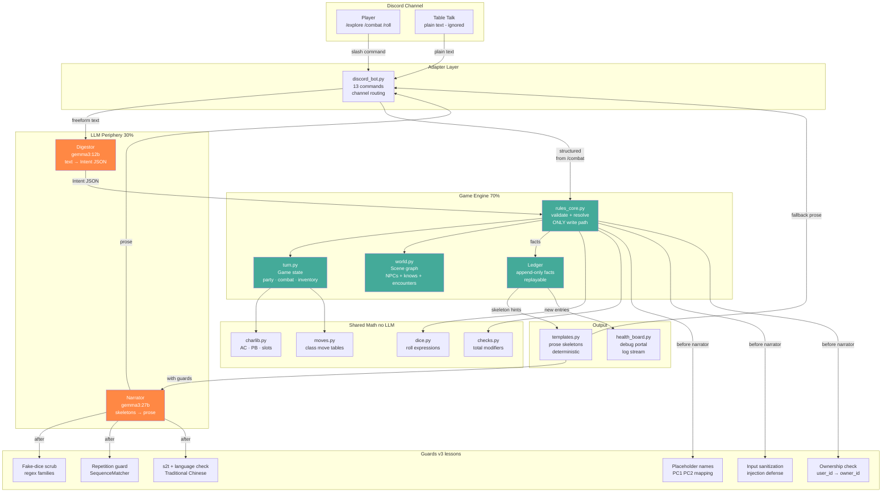
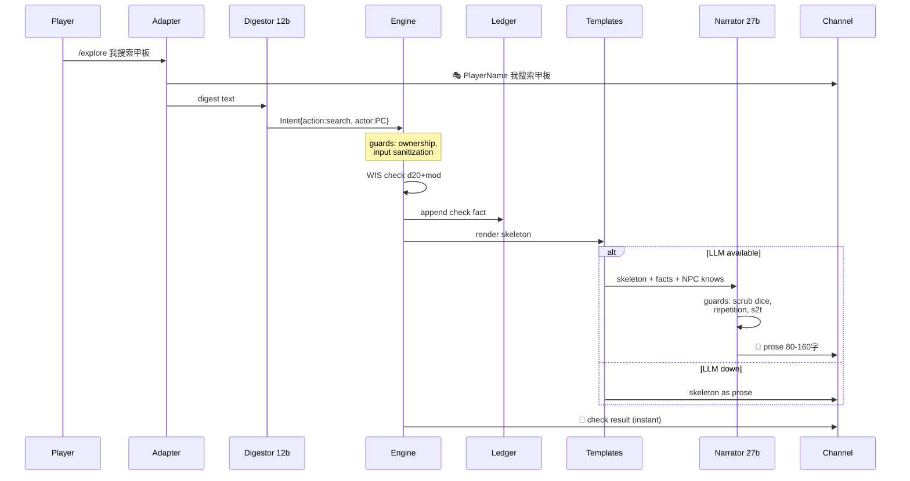
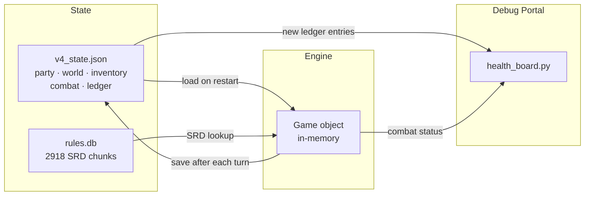

# v4 Architecture Diagram

## Turn Flow Detail

## Data Flow

## Key Design Decisions

| Decision | Why |
|---|---|
| Engine has the only write path | LLM cannot cheat — no attack surface |
| Ledger is append-only | Full audit trail, replayable |
| Narrator gets skeletons | Fewer tokens to generate, smaller hallucination surface |
| NPC `knows` lists | Narrator cannot invent quest content |
| Plain text = table talk | No accidental DM triggers from chatter |
| Structured /combat skips digestor | Zero ambiguity = zero confirmation |
| Selftest with seed | Byte-identical replays for regression |
